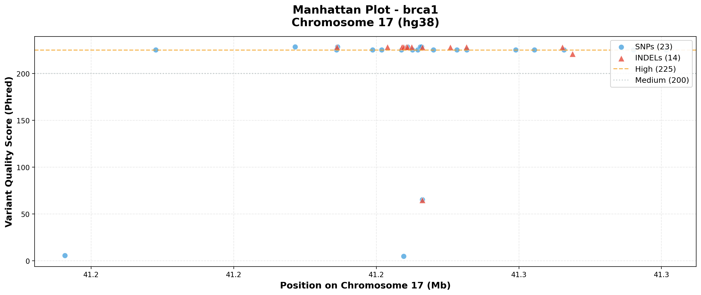
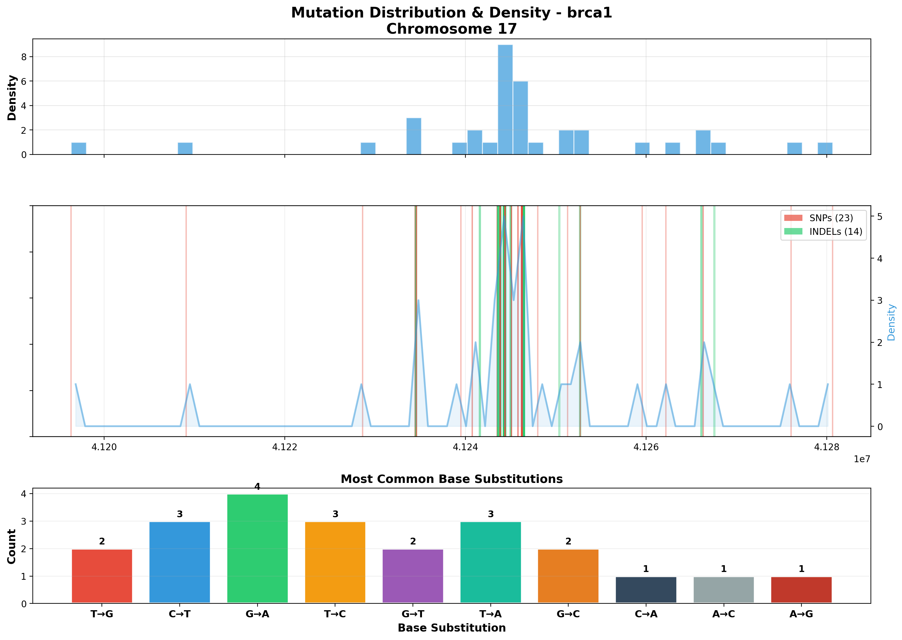
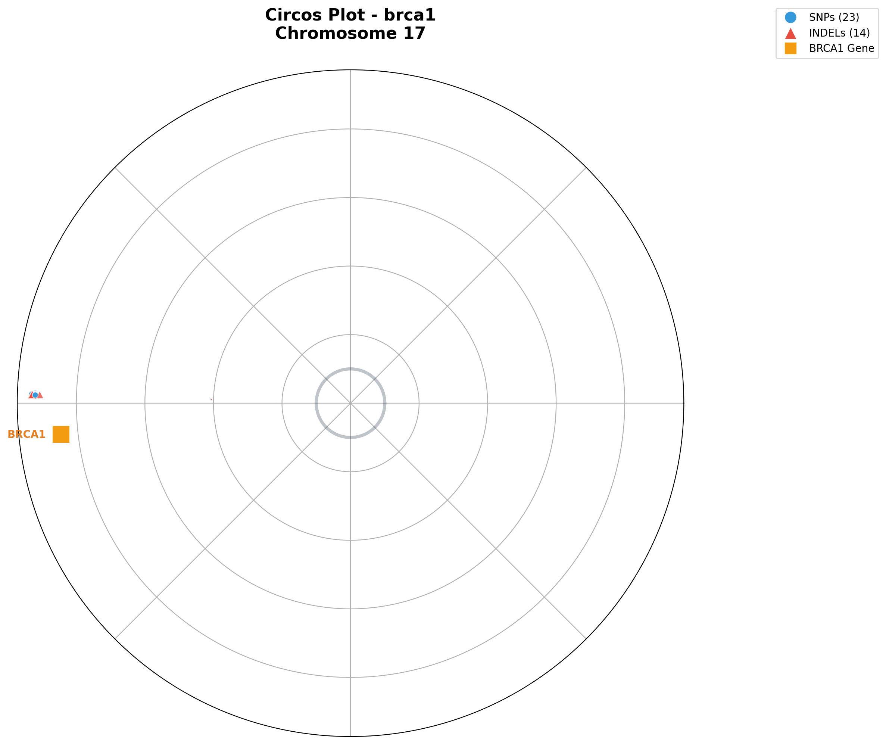

# DNA Sequence Variant Detection Pipeline

A bioinformatics pipeline for detecting genomic variants from DNA sequencing data, with automated reporting, visualization, and clinical database validation.

## What This Project Does

This pipeline takes raw DNA sequencing reads (FASTQ files), aligns them to a reference genome, identifies genetic variants (SNPs and INDELs), and produces:

- **Variant calls** in industry-standard VCF format
- **Text and HTML reports** with statistics and top variants
- **Three visualization plots** (Manhattan, Heatmap, Circos)
- **ClinVar validation** against NCBI's clinical variant database

The sample data included targets the **BRCA1 gene region** on **Chromosome 17** (hg38), a gene associated with hereditary breast and ovarian cancer susceptibility.

---

## Data Overview

### Input Data

| File | Description | Size |
|------|-------------|------|
| `reference/chr17.fa` | Human Chromosome 17 reference genome (hg38) | ~79 MB |
| `samples/brca1/raw/Brca1Reads_0.1.fastq` | Paired-end forward reads (R1) | ~20 MB |
| `samples/brca1/raw/Brca1Reads_0.2.fastq` | Paired-end reverse reads (R2) | ~20 MB |

- The **reference genome** is Chromosome 17 (~81.2 million base pairs), the chromosome where the BRCA1 gene is located (position ~43,044,295).
- The **FASTQ files** contain 200,000 paired-end sequencing reads (100 bp each) simulated from the BRCA1 region.

### Output Structure

```
samples/brca1/
  aligned/           -> SAM, BAM, sorted BAM, BAM index
  variants/          -> brca1_variants.vcf (37 variants detected)
  reports/           -> TXT report + HTML report
  plots/             -> Manhattan plot, Heatmap, Circos plot
  validation/        -> clinvar_validation.json
```

---

## Pipeline Steps

The pipeline runs 7 steps sequentially:

### Step 1-6: Variant Detection (`scripts/pipeline.py`)

```
FASTQ Reads  -->  Alignment  -->  SAM  -->  BAM  -->  Sorted BAM  -->  VCF
   (R1, R2)      (minimap2)         (samtools view)  (samtools sort)  (bcftools)
```

1. **Reference Indexing** - Builds an index of the reference genome using `minimap2 -d`
2. **Sequence Alignment** - Aligns paired-end reads to the reference using `minimap2 -ax sr`
3. **SAM to BAM Conversion** - Converts human-readable SAM to compressed BAM format using `samtools view`
4. **BAM Sorting** - Sorts alignments by genomic position using `samtools sort`
5. **BAM Indexing** - Creates a BAM index (.bai) for fast random access using `samtools index`
6. **Variant Calling** - Identifies SNPs and INDELs using `bcftools mpileup` + `bcftools call`

### Step 7: ClinVar Validation (`scripts/clinvar_api.py`)

Each variant is queried against the [NCBI ClinVar](https://www.ncbi.nlm.nih.gov/clinvar/) database via the E-utilities API. This checks whether the detected variants have known clinical significance (pathogenic, benign, uncertain, etc.).

### Step 8-9: Reporting and Visualization

- **Report Generation** (`scripts/report_generator.py`) - TXT and HTML reports
- **Plot Generation** (`scripts/plot_generator.py`) - Three visualization plots

---

## Results Summary

### Variant Statistics

| Metric | Count |
|--------|-------|
| Total Variants | 37 |
| SNPs (Single Nucleotide Polymorphisms) | 23 |
| INDELs (Insertions/Deletions) | 14 |
| High Quality (QUAL > 200) | 33 |
| Low Quality (QUAL <= 200) | 4 |

### Quality Distribution

| Quality Tier | Count |
|--------------|-------|
| Excellent (>= 225) | 32 |
| Good (200-224) | 1 |
| Moderate (100-199) | 0 |
| Low (< 100) | 4 |

### Top 5 Variants

| Rank | Position | Change | Quality | Type |
|------|----------|--------|---------|------|
| 1 | chr17:41,246,355 | G > C | 228.42 | SNP |
| 2 | chr17:41,246,187 | C > T | 228.42 | SNP |
| 3 | chr17:41,228,617 | G > A | 228.42 | SNP |
| 4 | chr17:41,234,574 | G > A | 228.41 | SNP |
| 5 | chr17:41,244,369 | T > G | 228.41 | SNP |

All variants cluster in the chr17:41,196,309 - 41,280,639 region, which falls within the BRCA1 gene locus (chr17:41,196,312 - 41,277,500). The 4 low-quality variants likely represent sequencing artifacts.

---

## Visualizations

### Manhattan Plot



A scatter plot showing all detected variants along Chromosome 17:
- **X-axis**: Genomic position on Chromosome 17 (in Megabases)
- **Y-axis**: Variant quality score (Phred scale)
- **Blue dots**: SNPs (23 variants)
- **Red triangles**: INDELs (14 variants)
- **Dashed lines**: Quality thresholds at 225 (high) and 200 (medium)

The tight clustering of variants around position ~41.2 Mb confirms they are concentrated in the BRCA1 gene region. Most variants have high quality scores (>225), indicating confident variant calls.

### Mutation Heatmap



A three-panel visualization:

1. **Top panel (Density Histogram)**: Shows the distribution of variants across the genomic region. Higher bars indicate more variants concentrated at that position.

2. **Middle panel (Strip Plot with Density Overlay)**: Each vertical line represents one variant. Red lines = SNPs, green lines = INDELs. Line opacity reflects local variant density. The blue curve shows the smoothed density estimate.

3. **Bottom panel (Base Substitution Frequencies)**: A bar chart showing the most common nucleotide substitutions observed. This helps identify mutational patterns (e.g., C>T transitions are common in many cancers).

### Circos Plot



A circular representation of Chromosome 17 with variant data:
- The **circle** represents the entire chromosome as a ring
- **Blue dots**: SNPs, sized by quality score
- **Red triangles**: INDELs, sized by quality score
- **Orange square**: BRCA1 gene marker at position 43,044,295
- Variant distance from the center indicates its quality score (farther = higher quality)

This view provides an intuitive way to see the spatial distribution of variants around the chromosome and their proximity to the BRCA1 gene.

---

## ClinVar Validation

The pipeline validates detected variants against NCBI's ClinVar database. For the included BRCA1 sample data, all 20 checked variants returned **"Not in ClinVar"**, which is expected since the FASTQ reads are simulated/synthetic data and do not correspond to real clinical variants.

In a production run with real patient data, this step would identify:
- **Pathogenic** variants (disease-causing)
- **Likely pathogenic** variants
- **Benign** variants (harmless)
- **Variants of uncertain significance (VUS)**

Results are saved to `samples/brca1/validation/clinvar_validation.json`.

---

## Tools Used

| Tool | Purpose | Version |
|------|---------|---------|
| [minimap2](https://github.com/lh3/minimap2) | Sequence alignment (reads to reference genome) | 2.30 |
| [samtools](http://www.htslib.org/) | SAM/BAM file manipulation (view, sort, index) | 1.23 |
| [bcftools](http://www.htslib.org/) | Variant calling from aligned reads | 1.23 |
| [Python](https://www.python.org/) | Pipeline orchestration, reporting, API queries | 3.x |
| [matplotlib](https://matplotlib.org/) | Plot generation (Manhattan, Heatmap, Circos) | - |
| [NumPy](https://numpy.org/) | Numerical computations for plots | - |
| [NCBI E-utilities API](https://www.ncbi.nlm.nih.gov/books/NBK25501/) | ClinVar variant lookup | - |

---

## How to Run

### Prerequisites

Install the required bioinformatics tools:

```bash
# Arch Linux (using yay for AUR packages)
yay -S minimap2 samtools bcftools

# Ubuntu/Debian
sudo apt install minimap2 samtools bcftools
```

Install Python dependencies:

```bash
pip install matplotlib numpy requests
```

### Running the Pipeline

```bash
cd DNA_SEQUENCE_ANALYSIS

# Run with auto-detected FASTQ files (from samples/<name>/raw/)
python3 main.py --sample brca1

# Run with explicit FASTQ paths
python3 main.py --sample brca1 --fastq1 path/to/R1.fastq --fastq2 path/to/R2.fastq

# Skip ClinVar validation (no internet needed)
python3 main.py --sample brca1 --skip-clinvar

# Skip plot generation
python3 main.py --sample brca1 --skip-plots
```

### Adding a New Sample

1. Create a folder structure: `samples/<sample_name>/raw/`
2. Place paired FASTQ files inside `raw/`
3. Run: `python3 main.py --sample <sample_name>`

The reference genome can be changed with `--reference path/to/genome.fa`.

---

## Project Structure

```
DNA_SEQUENCE_ANALYSIS/
  main.py                         # Entry point - argument parsing and pipeline orchestration
  reference/
    chr17.fa                      # Reference genome (Chromosome 17, hg38)
  scripts/
    pipeline.py                   # Core pipeline: alignment, conversion, variant calling
    report_generator.py           # TXT and HTML report generation
    plot_generator.py             # Manhattan, Heatmap, and Circos plot generation
    clinvar_api.py                # ClinVar API validation module
  samples/
    brca1/                        # Sample data and results
      raw/                        # Input FASTQ files
      aligned/                    # Alignment outputs (SAM, BAM)
      variants/                   # VCF variant calls
      reports/                    # TXT and HTML reports
      plots/                      # Visualization plots
      validation/                 # ClinVar validation results
```
